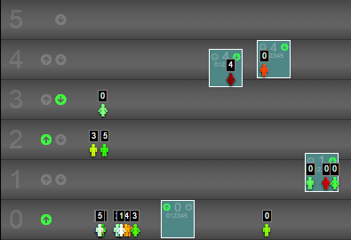

# elevator-saga-debug-ui
Color passengers based on how long they have been waiting, and other sweet stuff


WARNING
=======

Never run scripts found on the internet in your developer console unless you are completely confident about what you are doing.
For more information see:
[Wikipedia Self-CSS](http://en.wikipedia.org/wiki/Self-XSS)

Usage
=====

Just run this line of code in your developer console. (Oh the irony)

```
$('head').append('<script src="http://rawgit.com/sorgloomer/elevator-saga-debug-ui/master/injector.js"></script>');
```
